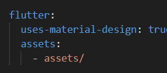
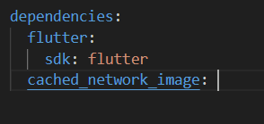

- When acesing the local images, one must create assets folder under the root of the project and update the pubsec.yaml file and put
assets folder

- when using the network cached image then again update the pubsec.yaml and run flutter pub get to get the latest dependency.

- for persistent modal state use showBottomSheet 
- for temporary bottom sheet just use showModalBottomSheet

- use animated_text_kit package for animated texts. [text](https://pub.dev/packages/animated_text_kit)